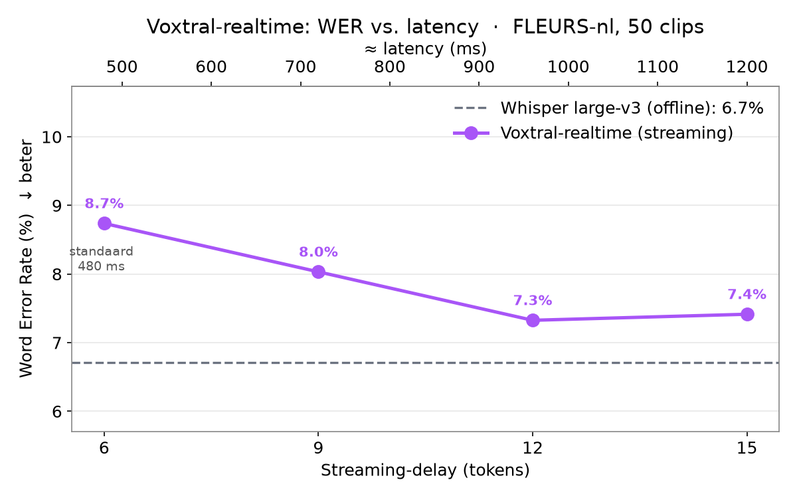

# Voxtral realtime transcription on Tesla V100

Run **Mistral's `Voxtral-Mini-4B-Realtime-2602`** streaming speech-to-text on a single
**Tesla V100 (Volta, sm_70)** via vLLM — keeping up with real time and then some.

> Measured: **RTF ≈ 0.41** (62.5 s of audio transcribed in 25.7 s — ~2.4× faster than
> real time), first-token latency ~0.1–0.3 s, accurate punctuated output, Dutch and 12
> other languages, on one 16 GB V100.

The realtime model's audio encoder uses a block-pooling attention that originally
hard-required Ampere+ FlashAttention, so it would not start on a V100. This repo provides
ready-to-use server and client scripts (including a live microphone demo) plus the
benchmarks behind the numbers above.

> **Good news on the prerequisite:** that encoder limitation has since been fixed
> **upstream**. With **1Cat-vLLM v1.2.1+** the realtime model runs on Volta out of the box —
> **no patch needed**. The two-line patch in `patches/` is only for older builds
> (1Cat-vLLM ≤ v1.1.0). See [Compatibility](#compatibility).

## Why this is non-trivial

| Approach | Result on a single V100 |
|---|---|
| 🤗 transformers (`VoxtralRealtimeForConditionalGeneration`) | Works, **but RTF ≈ 1.18** — falls ~20 % behind, lag accumulates |
| `torch.compile` on the transformers model | Fails (`NameError` from Inductor codegen on this custom model) |
| vLLM ≤ v1.1.0, unpatched | Engine fails to start: `NotImplementedError: FlashAttnV100Backend is not yet supported` |
| vLLM ≤ v1.1.0 **+ this patch** | ✅ **RTF ≈ 0.41** — keeps up real time with headroom |
| **vLLM v1.2.1+** (fix is upstream) | ✅ **RTF ≈ 0.41**, no patch needed |

The bottleneck was never raw FLOPs — a V100 has plenty for a 4B model. It was kernel-launch
overhead in the eager transformers loop. vLLM's CUDA graphs remove exactly that.

## Compatibility

| 1Cat-vLLM version | Realtime Voxtral on V100 | What to do |
|---|---|---|
| **v1.2.1+** (recommended) | ✅ works out of the box | install, **skip the patch** |
| v1.0.0 / v1.1.0 | ❌ encoder fails to start | apply `patches/whisper_causal_v100.patch` |

The upstream fix (in `vllm/model_executor/models/whisper_causal.py`) is equivalent to this
repo's patch: it widens the attention-backend gate to accept the Triton-based V100 backend
and delegates `get_kv_cache_shape` to the underlying backend. `patches/apply_patch.sh`
auto-detects an already-fixed install and skips, so it is safe to run on any version.

## Requirements

- **A Tesla V100** (Volta, sm_70), 16 GB or 32 GB. One card is enough — the model is 4B
  and fits in ~10 GB. More V100s let you run more concurrent instances; they are **not**
  required, and tensor-parallel with this patch is untested.
- **The 1Cat-vLLM Volta fork** — [github.com/1CatAI/1Cat-vLLM](https://github.com/1CatAI/1Cat-vLLM).
  This is the hard prerequisite: it's a public V100/sm_70 vLLM fork that ships the
  Triton-based `FlashAttnV100Backend` (`--attention-backend FLASH_ATTN_V100`) and is built
  against CUDA 12.8 (stock vLLM has no Volta backend, and default cu13x wheels drop Volta).
  **Use v1.2.1 or newer** (the realtime encoder fix is included). Install the prebuilt
  wheel into a Python 3.12 venv, e.g.:
  ```bash
  python3.12 -m venv ~/vllm-v100 && source ~/vllm-v100/bin/activate
  pip install --prefer-binary --extra-index-url https://download.pytorch.org/whl/cu128 \
    https://github.com/1CatAI/1Cat-vLLM/releases/download/v1.2.1/1cat_vllm-1.2.1-cp312-cp312-linux_x86_64.whl
  ```
  Validated end-to-end on **v1.0.0 + this repo's patch** (RTF 0.41). v1.2.1 contains an
  equivalent fix upstream; the same scripts apply.
- **The model weights**: `mistralai/Voxtral-Mini-4B-Realtime-2602` (auto-downloaded on first run).

> Tested on a 16 GB V100 with the defaults below. On a 32 GB V100 you can raise
> `--max-model-len` and `--max-num-seqs` substantially.

## Quick start

```bash
# 0) Install 1Cat-vLLM v1.2.1+ into ~/vllm-v100 (see Requirements).
#    On v1.2.1+ no patch is needed. On v1.0.0/v1.1.0, run the applier (it auto-detects
#    an already-fixed install and skips; it also installs the audio dependency):
VLLM_VENV=$HOME/vllm-v100 ./patches/apply_patch.sh

# 1) Start the server (single V100, port 8045). Wait for "Application startup complete."
VLLM_VENV=$HOME/vllm-v100 ./serve_voxtral_vllm.sh

# 2a) Transcribe a 16 kHz WAV file
$HOME/vllm-v100/bin/python clients/test_realtime_ws.py sample.wav

# 2b) Live microphone -> transcription (PipeWire default source)
$HOME/vllm-v100/bin/python clients/mic_realtime_vllm.py
#     specific source:  --source <node.name>     (see `wpctl status`)
#     ALSA instead:     --backend arecord --source plughw:CARD=PCH,DEV=0
```

Language is auto-detected — just talk.

## Web app

A polished browser app (record on/off, live streaming transcription, a voice-band volume
meter + live waveform, mic picker, copy/download, dark/light theme, and a Web-Audio signal-
processing chain) lives in [`webapp/`](webapp/). It serves over HTTPS and proxies the browser
audio to the realtime websocket — the vLLM port is never exposed to the browser.

```bash
VLLM_VENV=$HOME/vllm-v100 ./serve_voxtral_vllm.sh     # the model server
VLLM_VENV=$HOME/vllm-v100 ./webapp/run_webapp.sh      # https://<host>:8443
```

See [webapp/README.md](webapp/README.md) for details and the signal-processing notes.

## Benchmark: how good is it? (Dutch WER)

On 80 Dutch [FLEURS](https://huggingface.co/datasets/google/fleurs) clips (~13 min of read
speech), as Word Error Rate against [faster-whisper](https://github.com/SYSTRAN/faster-whisper):

| Model | WER ↓ | |
|---|---|---|
| Whisper large-v3 | **6.2 %** | offline, full context, 1.5 B |
| Whisper large-v2 | 7.8 % | offline, full context, 1.5 B |
| **Voxtral-realtime** | **9.0 %** | **streaming**, limited right-context, 4 B |
| Whisper medium | 12.6 % | offline, full context, 769 M |

The realtime model lands **between Whisper large-v2 and medium** — it beats offline medium
comfortably and trails large-v2/large-v3 by a few points, while doing the strictly harder
*streaming* job (committing text before the sentence has finished). And as the latency section
below shows, a little more delay lets it **overtake offline large-v2** outright.

Where it loses ground is mostly the **first word or two** of an utterance (its ~562 ms priming
window) and rare proper nouns / compounds:

```
ref:     er wordt met name gesteld dat niemand een leugen kan herkennen ...
whisper: Er wordt met name gesteld dat niemand een leugen kan herkennen ...
voxtral: Ruft mijn naam gesteld dat niemand een leugen kan herkennen ...   ← botched onset
```

Caveats: FLEURS is clean read speech (real conversation is harder for both); WER is inflated by
formatting — digits, casing, compound splits — not just real errors; and Whisper here is *offline*
while Voxtral is *streaming*, so this compares "what you get live from Voxtral" against a strong
offline reference, not the same task. Full notes, more examples, and your-own-audio mode in
[`bench/`](bench/):

```bash
python3.12 -m venv ~/whisper-bench
~/whisper-bench/bin/pip install -r bench/requirements-bench.txt
~/whisper-bench/bin/python bench/bench.py --n 80 --whisper-model large-v3 --gpu 0
~/whisper-bench/bin/python bench/bench.py --audio my_recording.wav   # side-by-side, no WER
```

## Latency vs. accuracy: tuning the streaming delay

Voxtral-realtime emits each token with a fixed **delay** (default `num_delay_tokens = 6`
≈ 480 ms): it commits text for audio that is 6 frames in the past, so it always has that
much *future* audio as context before deciding. That delay is the latency/accuracy dial.

Scaling it up (via `transcription_delay_ms` — see [`bench/delay_patch/`](bench/delay_patch/))
and re-measuring WER on the same 50 FLEURS-nl clips:



| Delay | Latency | WER ↓ |
|---|---|---|
| 6 tokens (default) | 480 ms | 8.7 % |
| 9 tokens | 720 ms | 8.0 % |
| 12 tokens | 960 ms | **7.3 %** |
| 15 tokens | 1200 ms | 7.4 % |

(Whisper baselines on the same 50 clips: large-v3 6.7 %, large-v2 8.5 %.)

More lookahead buys real accuracy: WER falls steadily and at **9 tokens (~720 ms) the streaming
model already overtakes offline Whisper large-v2** (8.5 %); by **12 tokens (~960 ms)** it reaches
7.3 %, closing most of the remaining gap to large-v3 — then flattens (15 tokens gives nothing
more). The model tolerates the larger delay cleanly even though it was trained at 6, so this is
effectively a free inference-time knob: **~double the latency for ~1.4 points of WER**, with
diminishing returns past ~960 ms.

Mistral's default of 6 is a deliberate sub-500 ms operating point. If your use case can spend
a second of latency (dictation, meeting notes, captions that lag a beat), raising the delay is
worth it; for snappy back-and-forth, keep it low. Reproduce → [`bench/run_delay_sweep.sh`](bench/).

## How the realtime API works

The realtime model is served over a **WebSocket** at `ws://<host>:8045/v1/realtime`
(auto-mounted by vLLM when the model supports the `realtime` task). The HTTP
`/v1/audio/transcriptions` endpoint does **not** work for this model — it requires a
multimodal embedding at every step, which only the streaming protocol provides.

Message flow (OpenAI-realtime style):

```
client → {"type":"session.update","model":"voxtral-realtime"}
client → {"type":"input_audio_buffer.append","audio":"<base64 PCM16 @16kHz>"}   (repeat)
client → {"type":"input_audio_buffer.commit"}                 # starts generation
server → {"type":"transcription.delta","delta":"..."}         (streamed)
client → {"type":"input_audio_buffer.commit","final":true}    # end of input
server → {"type":"transcription.done","text":"..."}
```

See `clients/test_realtime_ws.py` for a complete, minimal client.

**Latency knob:** Voxtral's streaming delay is configurable (multiples of 80 ms, 80–1200 ms
plus 2400 ms) via `num_delay_tokens` in the model's `tekken.json`. Default 6 tokens ≈ 480 ms,
which matches offline accuracy. Lower = snappier, slightly less accurate.

## The patch (only for 1Cat-vLLM ≤ v1.1.0)

> Not needed on v1.2.1+, where an equivalent fix is already upstream. Kept here for older
> builds and as documentation of what the fix does.

`patches/whisper_causal_v100.patch` changes two things in
`vllm/model_executor/models/whisper_causal.py`:

1. **Relax the backend gate.** `create_whisper_attention_backend_with_block_pooling`
   only accepted `FlashAttentionBackend` subclasses (Ampere+). We also accept
   `TritonAttentionBackend`, which the V100 backend (`FlashAttnV100Backend`) subclasses.
2. **Make the KV-cache shape backend-agnostic.** The block-pooling override hardcoded
   FlashAttention's `(2, num_blocks, …)` layout. We delegate to the underlying backend's
   `get_kv_cache_shape(...)` (with stretched `block_size` and reduced `num_kv_heads`), so it
   is correct for both FlashAttention `(2, blocks, …)` and Triton `(blocks, 2, …)`.

Everything else the wrapper needs (`do_kv_cache_update`, the `forward` signature,
`forward_includes_kv_cache_update`) already matches the Triton backend, so no further
changes are required.

> Memory note: block-pooling makes the KV cache expensive (~0.7 MB/token), so keep
> `--max-model-len` modest. The provided defaults (`max-model-len 4096`, `max-num-seqs 1`,
> `gpu-memory-utilization 0.92`) fit comfortably on a 16 GB V100 for single-user use.

## Repo layout

```
serve_voxtral_vllm.sh             vLLM launch script (single V100, port 8045)
patches/
  whisper_causal_v100.patch       the two-line fix (unified diff; only for <= v1.1.0)
  apply_patch.sh                  applier: detects already-fixed installs, adds audio deps
clients/
  mic_realtime_vllm.py            live microphone -> websocket (the main demo)
  test_realtime_ws.py             WAV file -> websocket, prints transcript + RTF
transformers_baseline/            reference path (works but lags) + benchmarks
  transcribe_live.py              mic -> transformers streaming (with a --meter mode)
  test_offline.py                 validate transcription on a reference clip
  bench_rtf.py                    measure real-time factor (shows the ~1.18 lag)
  bench_compile.py                torch.compile experiment (documents why it fails)
requirements-transformers.txt     deps for the transformers_baseline scripts only
bench/                            Whisper-vs-Voxtral Dutch WER benchmark
  bench.py                        FLEURS-nl WER (faster-whisper vs realtime Voxtral)
  voxtral_file.py                 transcribe any WAV via the realtime websocket
  results_largev3.*               example results (80 clips)
  requirements-bench.txt          deps (separate venv; CTranslate2, no torch)
  run_delay_sweep.sh              latency/accuracy sweep (6/9/12/15 delay tokens)
  delay_patch/sitecustomize.py    scales transcription_delay_ms at server start
  prep_clips.py / sweep_voxtral.py / plot_delay.py   sweep harness + chart
  whisper_eval.py                 score any Whisper model (extra baseline lines)
  delay_vs_wer.png                the WER-vs-latency chart (v3 + v2 baselines)
  realtest.py                     clip an m4a/mp3/wav -> Voxtral vs Whisper side-by-side
  gemma_correct.py                glossary post-correction (substitution-only)
```

## Troubleshooting

**`CUDA out of memory` during startup / KV-cache too small** (`estimated maximum model
length is N`). The block-pooling KV cache is expensive (~0.7 MB/token). On a 16 GB V100,
lower the context and keep one slot:
```bash
VLLM_MAX_CTX=4096 VLLM_MAX_SEQS=1 VLLM_GPU_MEM_UTIL=0.92 ./serve_voxtral_vllm.sh
```
If it OOMs *during profiling* (the audio encoder on dummy audio), also lower
`VLLM_MAX_BATCHED`. On a 32 GB V100 you can raise all of these.

**`NotImplementedError: FlashAttnV100Backend is not yet supported`** — you're on
1Cat-vLLM ≤ v1.1.0 without the patch. Run `patches/apply_patch.sh`, or upgrade to v1.2.1+.

**`AssertionError: For realtime you must provide a multimodal_embedding at every step`** —
you hit the HTTP `/v1/audio/transcriptions` endpoint. The realtime model only works over
the **WebSocket** `/v1/realtime`; use the clients in `clients/`.

**No transcription appears from the mic.** Audio probably isn't reaching the capture source.
Check the input level first (no model needed):
```bash
python transformers_baseline/transcribe_live.py --meter
```
If the bar never moves, fix the source: list PipeWire sources with `wpctl status` and pass
`--source <node.name>`, or use `--backend arecord --source <alsa-device>`.

**`Address already in use` / port clash.** Change the port: `VLLM_PORT=8046 ./serve_voxtral_vllm.sh`
(and `VOXTRAL_WS_URL=ws://localhost:8046/v1/realtime` for the clients).

**`patch: ... FAILED` when applying.** Your vLLM version differs from v1.0.0. If it's
v1.2.1+, you don't need the patch at all (the applier detects this and skips).

## Transformers baseline (reference / why vLLM)

The `transformers_baseline/` scripts are the simpler, dependency-light path. They produce
identical transcription quality but **lag ~20 % behind real time** on a V100 — useful as a
reference and to reproduce the diagnosis (`bench_rtf.py`). They need their own venv; see
`requirements-transformers.txt` (note the CUDA-12 torch pin for Volta).

## Credits & license

- Model: [Voxtral-Mini-4B-Realtime](https://huggingface.co/mistralai/Voxtral-Mini-4B-Realtime-2602)
  by Mistral AI (Apache-2.0).
- Serving: [vLLM](https://github.com/vllm-project/vllm) (Apache-2.0). The patch is a
  derivative of vLLM source.
- V100/Volta support: the [1CatAI/1Cat-vLLM](https://github.com/1CatAI/1Cat-vLLM) fork,
  which provides the `FlashAttnV100Backend` this work builds on. Huge thanks — without it
  none of this runs on Volta. As of **v1.2.1** it also includes the realtime-encoder fix
  upstream, so the patch here is only needed for older builds.
- This repo is released under the **Apache-2.0** license (see `LICENSE`).
